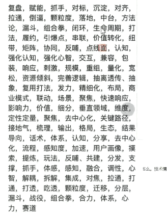
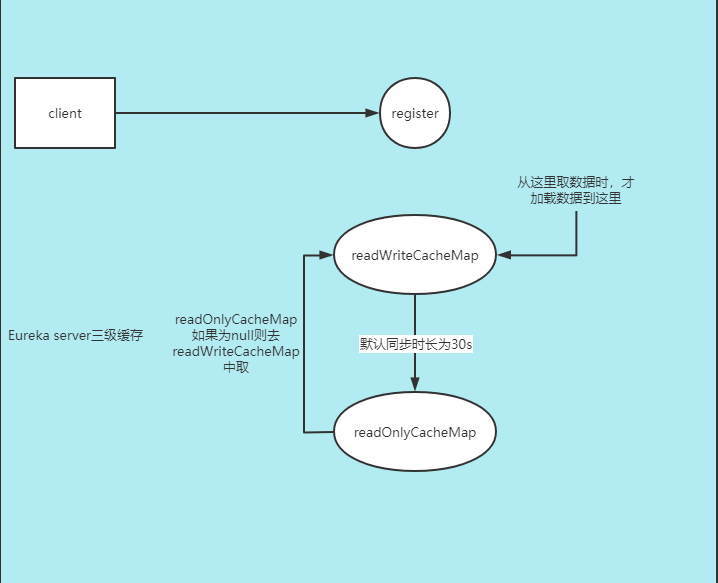

# 网约车


## 项目过程

### 启动：

可行性分析，立项。

**面试：（背景，为什么做？残障人士（后备箱有轮椅），孕妇（开车比较稳的司机），小孩（儿童座椅））**


### 计划阶段：

进度安排，资源计划，成本估计，质量保证计划，风险，实施。

**面试：加班，加人，功能排优先级，重要的先做保证能用，后面再迭代。**


### 实施控制阶段：

开发，测试，等等


### 收尾

验收。产品验收。


## 项目和产品

矩阵式（开发：1组，2组，产品：1组，2组），项目组。

开发流程


## 人员安排

项目管理：3（1高级项目经理，2助理）

技术总监：1

运维：2

能力层：10

业务层：12

产品：10（乘客，司机，boss，h5）

安卓：4

ios：3

h5：5

测试：20（功能，自动化测试，接口测试，安全测试）

运营，市场，大客户关系：未知


## 你在项目中的职责

组长：接口定义，工程结构设计，代码review，各方沟通（产品，测试），核心功能开发。

组员：具体开发实现，核心功能开发。


Kick Off：把项目经理，开发，产品，运营等人叫在一起开会。各方参与，齐聚一堂，启动会，动员大会。


## 实现的需求

### 乘客端：

1.发送验证码。

```markdown
三档验证。技术人员防止恶意发短信。
```


2.登录/注册

3.查看开通区域

```markdown
高德围栏
```


4.预估价格。

5.下单

6.司机流程

7.支付（分布式事务：订单，支付，积分）

8.评价

### 司机端：

1.发送验证码

2.登录，注册

3.查看，改变司机状态

4.司机抢单（分布式锁）

5.订单状态变更

6.发起收款


### boss

运营。


## 微服务设计原则

架构，模式，拆分，隔离，实现的目标：**隔离系统的变化点。**


### 具体原则：

高内聚，低耦合。

高度自治：开发，测试，构建，部署，运行，发布。（无状态）

以业务为中心。

弹性设计。（容错，隔离，降级）。

自动化。持续集成，持续交付。

粒度把控：没有标准。任何一个服务，不要因为自己的开发和维护，影响其它服务。


api组，service组。

业务层，能力层。


### AKF：

x轴：水平复制。多部署服务器来解决高并发。

y轴：纵向拆分，比如拆分成微服务

z轴： 数据分片：eg.淘宝上搜索手机，衣服，家电...，搜索手机是在手机数据中搜索等


## 整体架构图


## 服务拆分


### 业务层：


| 模块     | 项目名           | 描述     |
| -------- | ---------------- | -------- |
| 乘客端   | api-passenget    | 乘客端   |
| 司机端   | api-driver       | 司机端   |
| 司机听单 | api-listen-order | 司机听单 |


### 能力层：


| 模块         | 项目名                    |
| ------------ | ------------------------- |
| app升级      | service-app-update        |
| 订单         | service-order             |
| 派单         | service-order-dispatch    |
| 乘客用户管理 | service-passenger-user    |
| 短信         | service-sms               |
| 计价         | service-valuation         |
| 验证码       | service-verification-code |
| 钱包         | service-wallet            |
| 支付         | service-payment           |


能力层：qps:2000，有些要求300就行


### spring cloud基础模块：


| 模块           | 项目名                  |
| -------------- | ----------------------- |
| 注册中心       | cloud-eureka            |
| 配置中心       | cloud-config-server     |
| 网关           | cloud-zuul              |
| 熔断监控（ui） | cloud-hystrix-dashboard |
| 健康检查       | cloud-admin             |
| 链路追踪       | cloud-zipkin-ui         |


### 公共模块：

所有服务都引用的一个二方库

| 模块                         | 项目名          |
| ---------------------------- | --------------- |
| 通用模块，工具类，异常，校验 | internal-common |


## 用到的技术

springboot，springcloud，maven，git，mysql，redis，mq


### 第三方

短信服务（腾讯，阿里云，华信）

语音服务（隐私号，乘客和司机订单匹配后，司机向乘客所拨打的电话为隐私号，并具有录音功能）

文件服务（OSS）

地图服务（高德）

消息推送（极光：透传、通知）

支付：微信、支付宝

接送机服务：航旅纵横（查航班）

发票：百望云


**面试包装很重要**





## 接口

接口定好之后，app，前端，后端，可以同时开发

后端定接口


### 好的接口设计

restful风格（资源变现层状态转移），http协议支持，**注重资源**

协议：https，IOS只能使用https（?）

域名：/api.yuming.com/

端口：

版本：v1

路径：/xxoo/xxoo/（路径中大部分是名词）

动作：

post：新建

put：修改（修改后的全量数据）

patch：修改（修改哪个，传哪个）

delete：删除

get：查询


### 接口的安全

三级等保

1.CIA：保密性，完整性，可用性

2.手机号，身份证号，需要脱敏


3.数据层面：sql注入

4.XSS：恶意脚本（<script>），spring-htmlutils解决

在正常请求中执行了黑客提供的恶意代码。**问题出在：主要是用户数据没有过滤，转义**

CSRF：跨站伪造请求。解决：人机交互，token

冒充别人的登录信息。 **问题出在：没有防范不信任的调用**


referer


5.数据权限控制。

```markdown
链接请求link1

A用户执行链接，删除A用户的订单

B用户也能拿到这个链接，删除A用户的订单。

必须要规避上述问题
```


## 微服务项目结构

项目独立仓库中


### 结构：

整体

```sh
|-- online-taxi-three
	|-- 项目A
	|-- 项目B
```


独立项目

```sh
|-- pom
|-- src
	|-- controller
	|-- service
		|-- impl
		|-- 接口
	|-- dao
    	|-- entity
    	|-- mapper
    |-- manager	
    |-- constant
    |-- request 接受的参数bean
    |-- response 返回参数bean
 |-- resource
 	|-- mapper
    	|-- Mapper.xml
    |-- yml	
```


### 异常：

dao层的异常：不用打日志。catch住，抛出去

service：打日志，详细信息。时间，参数

controller：异常包装成状态码


公司maven私服：

假如有多方需要调用 UserBean，这时就需要把该bean提取到公共模块common中。此时的common模块也叫二方库


### eureka

#### eureka集群搭建

见工程


#### eureka-server优化

@EnableEurekaServer和pom导入

```xml
<dependency>
    <groupId>org.springframework.cloud</groupId>
    <artifactId>spring-cloud-starter-netflix-eureka-server</artifactId>
</dependency>
```

组成eureka-server


##### 不同数量服务的自我保护


问题：

eureka设置的自我保护阈值为 80%

现在假设有10台微服务，现在有三台出现了问题，值变为70%，此时触发自我保护机制，当第4台服务是真的挂了，由于自我保护机制，第4台是不会真正的踢出的，此时就有可能调用到不可用的服务


100台服务，三台出问题，97%，未达到阈值


针对上述问题的优化点：

服务数量少，则不保护。服务数量多，则保护。

针对服务下线，可以写监听，监听服务的下线，然后针对下线可以发送邮件。

```java
@Component
public class EventListen {
    public void listen(EurekaInstanceCanceledEvent event){
        // 模拟发邮件或短信
        System.out.println("服务下线: " + event.getServerId());
    }
}
```


##### 快速下线

```yml
eureka:
  server:
    # 踢出服务的间隔时间，如果该时间间隔太长，则消费方可能会拉取到不可用的服务
    eviction-interval-timer-in-ms: 1000
```


##### eureka源码代码优化：

```java
/*
  多线程并行处理定时任务时，Timer运行多个TimeTask时，只要其中之一没有捕获抛出的异常，
  其它任务便会自动终止运行，使用ScheduledExecutorService则没有这个问题
*/
Timer timer = new Timer();
```


##### 为什么说Eureka实现了CAP中的AP没有实现C？在哪没有实现C？

readOnly和readWrite有同步时间，两者的数据不是实时的。

ApplicationResource#addInstance，就是服务注册进来，server端会调用

```java
//Eureka是基于内存的，Map<服务名,Map<实例id,实例信息>>
private final ConcurrentHashMap<String, Map<String, Lease<InstanceInfo>>> registry
            = new ConcurrentHashMap<String, Map<String, Lease<InstanceInfo>>>();
```

从其它peer拉取注册表。

```java
// 没有满足C的地方
int registryCount = this.registry.syncUp()
```

CAP中的P：网络不好的情况下，还是可以拉取到注册表进行调用的。服务还是可以使用。


server端：1.接收注册 2.接收心跳 3.下线 4.获取注册列表 5.集群同步


##### 三级缓存




#### 自我保护服务剔除：eureka优化

1.开关

2.阈值


##### server源码

剔除（本质也是下面的下线）：长时间没有心跳的服务，eureka server将它从注册表剔除

注册：

续约：

下线：

集群间同步：

拉取注册表：

1.全量拉取

2.增量拉取

```java
/*
保留最近三分钟的注册信息，实际使用的时候，设置心跳，拉取注册表的时间间隔设置都是秒级，不要设置的过长
*/
recentlyChangedQueue
```


此处有一个编程小技巧

```java
//Lease<InstanceInfo>，InstanceInfo服务实例
//租约    
public class Lease<T> {
    private T holder;
    private long evictionTimestamp;
    private long registrationTimestamp;
    private long serviceUpTimestamp;
    // Make it volatile so that the expiration task would see this quicker
    private volatile long lastUpdateTimestamp;
    private long duration;
}
//由租约持有服务实例，并将经常变化的时间放在租约类里面。这样可以有别的服务的租约，传入不同的实例
//频繁的续约操作不会影响服务实例
```


#### 服务测算

20个服务 每个服务部署5个。eureka client：100个

心跳：向server发送我们还活着

仅心跳，默认一个client心跳30s / 1次 ,1min / 2次 ，总计 100 * 2 = 200次，即一个server一分钟200次。

一天 24 * 60 * 200 = 288,000 次

服务拉取，默认也是30s / 1次

两项总计：288000 * 2 = 576000

一个eureka server服务每天承受访问量：几十万次


集群并没有增加承载能力，只是增加了高可用


#### 集群同步

1.注册：第一次注册同步，后面注册不同步

2.续约：一直同步，所有集群

3.下线：一直同步，所有集群

4.剔除：没有同步


生产：服务重启时，先停服务，再手动触发下线（停服后，服务还在注册中心挂着，所以需要手动下线）


#### eureka有区域的概念

优先调用在同一个区域的服务


server端：

```yml
server:
  port: 7911

spring:
  application:
    name: cloud-eureka-cdz1

eureka:
  client:
    register-with-eureka: false
    fetch-registry: false
    #service-url:
      #defaultZone: http://localhost:7900/eureka/,http://localhost:7901/eureka/,http://localhost:7902/eureka/
    # 当前区域,cd-成都
    region: cd
    # 可用区
    availability-zones:
      cd: z1,z2
    service-url:
      z1: http://localhost:7911/eureka/,http://localhost:7912/eureka/
      z2: http://localhost:7921/eureka/,http://localhost:7922/eureka/

  server:
    # 是否开启自我保护
    enable-self-preservation: false
    # 设置阈值
    renewal-percent-threshold: 0.85
    # 踢出服务的间隔时间，如果该时间间隔太长，则消费方可能会拉取到不可用的服务
    eviction-interval-timer-in-ms: 1000
    # 关闭从readOnly读注册表
    use-read-only-response-cache: false
    # readOnly和readWrite同步时间间隔（查询出可用服务的时间间隔，提高查询可用服务的速度）
    response-cache-update-interval-ms: 1000
```


client端：

```yml
server:
  port: 8080

eureka:
  client:
    service-url:
      #defaultZone: http://localhost:7900/eureka
      z1: http://localhost:7911/eureka,http://localhost:7912/eureka
      z2: http://localhost:7921/eureka,http://localhost:7922/eureka
    # 服务拉取
    #registry-fetch-interval-seconds: 30
    # 注册的区域
    region: cd
    # 只给z1注册
    availability-zones:
      cd: z1
    # 优先调用相同区域的服务
    prefer-same-zone-eureka: true

  instance:
    lease-renewal-interval-in-seconds: 10
    # 优先区为z1
    metadata-map:
      zone: z1

spring:
  application:
    name: api-passenger
```


#### eureka-client


#### 总结

server配置总结

```yml
server:
    # 是否开启自我保护，主要看服务多少
    enable-self-preservation: false
    # 设置自我保护阈值
    renewal-percent-threshold: 0.85
    # 踢除服务的间隔时间，如果该时间间隔太长，则消费方可能会拉取到不可用的服务
    eviction-interval-timer-in-ms: 1000
    # 关闭从readOnly读注册表
    use-read-only-response-cache: false
    # readOnly和readWrite同步时间间隔（查询出可用服务的时间间隔，提高查询可用服务的速度）
    response-cache-update-interval-ms: 1000
```


生产中的问题：

1.优化目的：减少服务上下线的延时

2.自我保护的选择：看网络和服务情况

3.服务更新，要先停服务，再发送下线请求


client配置总结

刷新注册表（拉取注册表）间隔

心跳间隔

饥饿加载，防止第一次请求超时

```yml
eureka:
  client:
    service-url:
      # 默认注册和拉取只用第一个地址的注册中心，第一个注册中心挂了，才去第二个注册中心拉取和注册，依次类推
      # 为了不让某个server压力过大，实际工作中，每个client 要把后面的url，随机打乱，
      defaultZone: http://localhost:7900/eureka,http://localhost:7901/eureka,http://localhost:7902/eureka
    # 注册表拉取间隔
    registry-fetch-interval-seconds: 3
    # 默认注册，false不注册
    enabled: true
  instance:
    #访问信息有ip信息提示
    prefer-ip-address: true
    #Eureka客户端向服务端发送心跳的时间间隔，单位为秒（默认是30秒）
    lease-renewal-interval-in-seconds: 1
    #Eureka服务端在收到最后一次心跳后等待时间上限，单位为秒（默认是90秒），超时将剔除服务
    lease-expiration-duration-in-seconds: 2
    
# 饥饿加载
ribbon:
  eager-load:
    clients: api-passenger
    enabled: true    
```


server-url：顺序打乱，不要所有服务都写一样顺序的配置


### 业务


#### 乘客端登录验证功能


搭建公共模块

```xml
<groupId>com.qinhao</groupId>
<artifactId>internal-common</artifactId>
<version>0.0.1-SNAPSHOT</version>
```

0.0.1-SNAPSHOT：带SNAPSHOT的意思是你本地有，服务器端更新后，会再次拉取这个版本的jar到本地

不带SNAPSHOT的就是服务器端更新后，不会再次拉取这个版本的jar到本地

**如果上线使用了带SNAPSHOT的，如果有人往私库中提交东西，没经过测试，就打包编译进去了，生产上就会出问题。**

**生产中不能使用快照版本**


review代码时，修改代码后效率提升5倍

将堆空间的操作移到栈上

```java
public static void main(String[] args) {

    int num = 10000000;
    long start1 = System.currentTimeMillis();
    for (int i = 0; i < num; i++) {
        String code = (Math.random() + "").substring(2, 8);
    }
    long end1 = System.currentTimeMillis();
    System.out.println(end1 - start1);

    long start2 = System.currentTimeMillis();
    for (int i = 0; i < num; i++) {
        String code = String.valueOf((int) (Math.random() * 9 + 1) * Math.pow(10, 5));
    }
    long end2 = System.currentTimeMillis();
    System.out.println(end2 - start2);

}
```


##### 估算线程数

```markdown
估算线程数
16核 应该开几个线程
线程数 = CPU可用核数 / （1 - 阻塞系数（io密集型接近1，计算密集型接近0））
eg.假如是io密集型，假定阻塞系数0.9 线程数 = 16 / 0.1 = 160
假如是计算密集型，假定阻塞系数0.1 线程数 = 16 / 0.9 = 17
阻塞系数没有定量的值只有定性的分析！！
```


##### 提升QPS

```markdown

1.提高并发数
     1.能用多线程用多线程
     2.增加各种连接数：tomcat mysql redis等等
     3.服务无状态，便于横向扩展，扩机器
     4.让服务能力对等（serviceUrl:打乱顺序）
2.减少响应时间
     1.异步（最终一致性，不需要及时响应），流量削峰
     2.缓存（减少db读取，减少磁盘io，读多，写少）
     3.数据库优化
     4.多的数据，分批次返回
     5.减少调用链
     6.长连接。不要轮询
```


#### 计价规则


#### 抢单

多个服务竞争一个资源，会用到分布式锁

订单是在付款前生成还是付款后生成：电商项目是在付款后生成，网约车是在付款前生成（因为已经开始享受服务）

一个订单包含以下内容：

```markdown
乘客id,手机号
司机信息
设备号用作设备黑名单（此设备乘客，不给钱，以后这个设备不能叫车）
起点经纬度（地图SDK，GPS信息：经纬度，高度，行进方向，速度等）
起点名称
终点
车辆信息：车牌号
下单时间
订单开始时间
司机出发去接乘客，时间，经纬度
司机到达乘客上车点的时间，经纬度
司机乘客上车时间，经纬度
司机到达乘客目的地的时间，经纬度
```


### 灰度发布


### 项目经验


#### zuul生产中的问题

##### 1.敏感信息（cookie,token）不向后传

```yml
zuul:
  # 配置为空，表示忽略下面的值向微服务传播，所有请求头都透传到后面微服务，解决token不后传的问题
  sensitive-headers:
```


##### 2.老项目改造中路由问题


